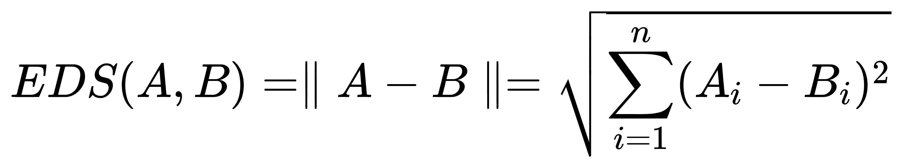
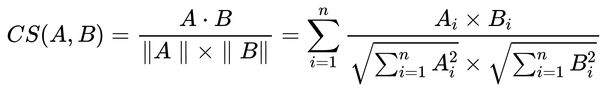
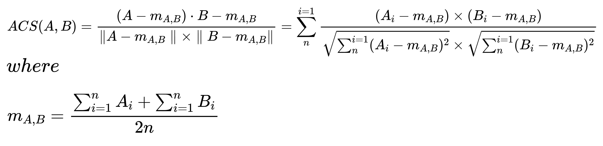

# Similarity Methods


### euclidean distance similarity

```euclidean_distance_similarity.py```



```EDS(A, B) = \parallel A - B\parallel = \sqrt{\sum_{i=1}^{n} (A_i - B_i)^2}```


### cosine similarity

```cosine_similarity.py```



```CS(A, B) = \frac{A\cdot B}{\parallel A\parallel \times \parallel B\parallel } =\sum_{n}^{i=1} \frac{A_i\times B_i}{\sqrt{\sum_{n}^{i=1} A_i^2} \times \sqrt{\sum_{n}^{i=1} B_i^2}}```


### adjusted cosine similarity

```adjusted_cosine_similarity.py```



```
ACS(A, B) = \frac{(A-m_{A,B})\cdot B-m_{A,B}}{\parallel A-m_{A,B}\parallel \times \parallel B-m_{A,B}\parallel } =\sum_{n}^{i=1} \frac{(A_i-m_{A,B})\times (B_i-m_{A,B})}{\sqrt{\sum_{n}^{i=1} (A_i-m_{A,B})^2} \times \sqrt{\sum_{n}^{i=1} (B_i-m_{A,B})^2}}
where
m_{A,B} = \frac{\sum_{i=1}^{n} A_i + \sum_{i=1}^{n} B_i}{2n}
```
